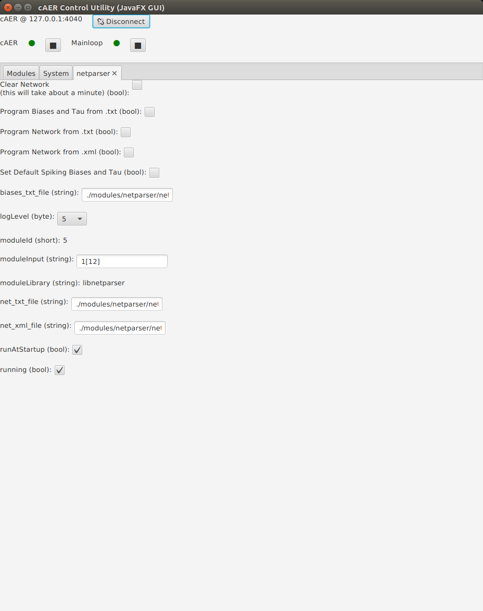
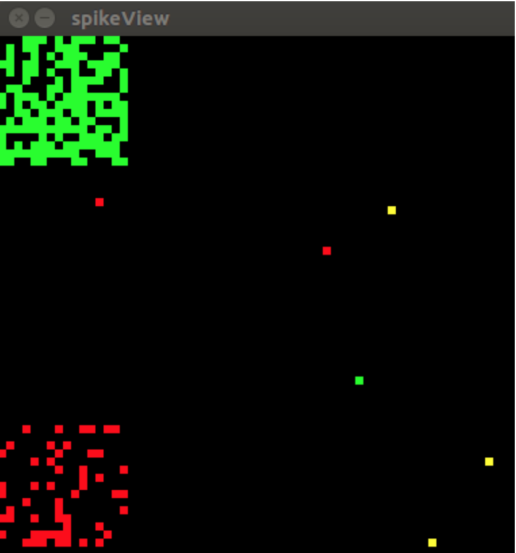
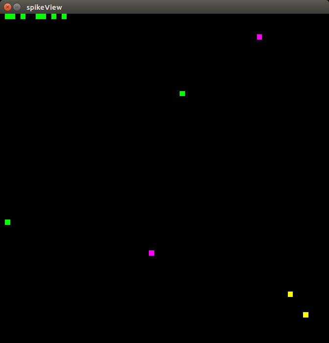

# NetParser cAER Module

The netparser is a network (neural network) manager. It serves two main functions:

1. It abstracts away having to manually set the SRAM and CAM registers to connect two neurons. 
2. It keeps a map off all connections made through it, enabling connection queries.

If you just want to use this module to easily program dynapse neuron connections read the [tutorial](#tutorial-pane) section. 

If you want to understand how this module works so that you can call its functions as an API inside cAER or contribute to it, read the [further documentation](#further-documentation-pane) first, then come back and read the tutorial.

# <a name="tutorial-pane"></a>Tutorial Table

- [TXT Parser](#txt-pane)
	- [Format](#txt-format-pane)
	- [Examples](#txt-examples-pane) 
	- [Scripts](#txt-script-pane)
- [XML Parser](#xml-pane)
	- [Format](#xml-format-pane)
	- [Examples](#xml-examples-pane) 
	- [Scripts](#xml-script-pane)
- [Biases and Tau Parser](#biases-tau-pane)
	- [Format](#biases-format-pane)
	- [Examples](#biases-examples-pane) 
- [GUI](#gui-pane)
- [Tests](#test-pane)
- [Further documentation and limitations (READ IT!)](#further-documentation-pane)
- [Warning and errors (and Possible solutions)](#warnings-errors-pane)


## Parsers
---
This module includes two parsers: a first one that can "read in" a network topology from either a [.txt](#txt-pane) or an [.xml](#xml-pane) file and program the dynapse to match it, and a second one able to read a Briases and Tau configuration and apply it to Dynap-se.

## <a name="txt-pane"></a> Network TXT Parser
---
In this section I'll explain the [**format**](#txt-format-pane) of the network document with some [**examples**](#txt-examples-pane). I'll show a small [**script**](#txt-script-pane) to generate these files and show you how to use the [**java gui interface**](#gui-pane) for this module to program the dynapse with it. 

### <a name="txt-format-pane"></a>Format
---
**Connection Format**: 

`PreSynaptic_address`-`connection_type`-`CAM_slots`->`PostSynaptic_address`

Where addresses have the following format:

**Address**: U`ChipID`-C`CoreID`-N`NeuronID`

**Connection Type**:
There are 4 `connection_type`s

Connection Type | ID | 
----------------|----|
Slow Inhibitory | 0  |
Fast Inhibitory | 1  |
Slow Excitatory | 2  |
Fast Excitatory | 3  | 

**CAM_slots**:
 `CAM_slots` go from `01-64`

I think examples illustrates this much better.

### <a name="txt-examples-pane"></a>Examples
---
#### One connection

If I want to connect neuron 5 from core 1 from chip 0 to neuron 6 from core 3 from chip 2 using an excitatory fast connection (3) and taking up 8 CAM slots I would simply write:

`U00-C01-N005->3-08-U02-C03-N006`

If I instead wanted to do so with a slow inhibitory connection I would just change the connection type from a 3 to a 0:

`U00-C01-N005->0-08-U02-C03-N006`

If I wanted to instead use all the CAMs in neuron `U02-C03-N006`, I would change the 08 to 64:

`U00-C01-N005->0-64-U02-C03-N006`

If I wanted to only program the neuron CAM such to use FPGA spike generator to send events in neuron `U02-C03-N006`, I would just change the source neuron from U00 to U04. U04 can be seen as an external chip input. The address that will be written in the destination neuron CAM is specified by the source neuron core and number (in this case `C01-N005`)

`U04-C01-N005->0-64-U02-C03-N006`

#### Many connections

Finally, we can obviously set more than one connection. Here is an example of a file that would connect neurons 1 through 5 from core 1 in chip 0 to neurons 6 through 10 from core 3 in chip 2 using fast excitatory connections and all CAM slots in the post synaptic neurons.

```
U00-C01-N001-3-64->U02-C003-N006
U00-C01-N002-3-64->U02-C003-N007
U00-C01-N003-3-64->U02-C003-N008
U00-C01-N004-3-64->U02-C003-N009
U00-C01-N005-3-64->U02-C003-N010
```
### <a name="txt-script-pane"></a>Scripts
---
As you can imagine, creating these files is quite easy. For example, here is a python script to generate a file that will connect the first 5 neurons in cores 1 and 3 from chip 0 to chip 2. 

```
filename = 'myNetwork.txt'

cores = [1,3]
neurons = range(5)

with open(filename, 'w') as f:
	for core in cores:
		for neuron in range(neurons):
			f.write('U00-C{:02d}-N{:03d}-2-16->
                   U02-C{:02d}-N{:03d}\n'.format(
                   core, neuron, core, neuron))

```

Which outputs the following file

```
U00-C01-N000-2-16->U02-C01-N000
U00-C01-N001-2-16->U02-C01-N001
U00-C01-N002-2-16->U02-C01-N002
U00-C01-N003-2-16->U02-C01-N003
U00-C01-N004-2-16->U02-C01-N004
U00-C03-N000-2-16->U02-C03-N000
U00-C03-N001-2-16->U02-C03-N001
U00-C03-N002-2-16->U02-C03-N002
U00-C03-N003-2-16->U02-C03-N003
U00-C03-N004-2-16->U02-C03-N004
```


## <a name="xml-pane"></a> Network XML Parser
---
In this section I'll explain the [**format**](#xml-format-pane) of the network document with some [**examples**](#xml-examples-pane). I'll show a small [**script**](#xml-script-pane) to generate these files and show you how to use the [**java gui interface**](#gui-pane) for this module to program the dynapse with it. 

### <a name="xml-format-pane"></a>Format
---
**Document Format**:
The XML connection document should folow the following format. 

```
<?xml version='1.0' encoding='UTF-8'?>
<CONNECTIONS>
  <CONNECTION> conection info 1 </CONNECTION>
  <CONNECTION> conection info 2 </CONNECTION>
  				...
  <CONNECTION> conection info N </CONNECTION>
</CONNECTIONS>
```

**Connection Format**: 
Individual connections should have the following format

```
<CONNECTION cam_slots_number="16" connection_type="1">
    <PRE CHIP="1" CORE="1" NEURON="217"/>
    <POST CHIP="0" CORE="0" NEURON="217"/>
</CONNECTION>
```
Where the connection types are as follows:

Connection Type | ID | 
----------------|----|
Slow Inhibitory | 0  |
Fast Inhibitory | 1  |
Slow Excitatory | 2  |
Fast Excitatory | 3  | 

and the other parameters have the following ranges 

Parameter 	    | Range  | 
-----------------|--------|
CHIP             | 0-3 	   |			
CORE			    | 0-3    |			
NEURON			    | 0-255  |			
cam_slots_number | 1-64   |			

I think examples illustrates this much better.

### <a name="xml-examples-pane"></a>Examples
---
#### One connection

If I want to connect neuron 5 from core 1 from chip 0 to neuron 6 from core 3 from chip 2 using an excitatory fast connection (3) and taking up 8 CAM slots I would simply write:

```
<CONNECTION cam_slots_number="8" connection_type="3">
    <PRE CHIP="0" CORE="1" NEURON="5"/>
    <POST CHIP="2" CORE="3" NEURON="6"/>
</CONNECTION>
```

If I instead wanted to do so with a slow inhibitory connection I would just change the connection type from a 3 to a 0:

```
<CONNECTION cam_slots_number="8" connection_type="0">
    <PRE CHIP="0" CORE="1" NEURON="5"/>
    <POST CHIP="2" CORE="3" NEURON="6"/>
</CONNECTION>
```

If I wanted to instead use all the CAMs in neuron `U02-C03-N006`, I would change the 08 to 64:

```
<CONNECTION cam_slots_number="64" connection_type="0">
    <PRE CHIP="0" CORE="1" NEURON="5"/>
    <POST CHIP="2" CORE="3" NEURON="6"/>
</CONNECTION>
```

If I wanted to only program the neuron CAM such to use FPGA spike generator to send events in neuron `U02-C03-N006`, I would just change the PRE CHIP parameter from 2 to 4. Chip 4 can be seen as an external chip input. The address that will be written in the destination neuron CAM is specified by the source neuron core and number (in this case `CORE="1" NEURON="5"`)

```
<CONNECTION cam_slots_number="64" connection_type="0">
    <PRE CHIP="4" CORE="1" NEURON="5"/>
    <POST CHIP="2" CORE="3" NEURON="6"/>
</CONNECTION>
```

#### Many connections

Finally, we can obviously set more than one connection. Here is an example of a file that would connect neurons 1 through 3 from core 1 in chip 0 to neurons 4 through 7 from core 3 in chip 2 using fast excitatory connections and all CAM slots in the post synaptic neurons.

```
<CONNECTIONS>
  <CONNECTION cam_slots_number="64" connection_type="3">
    <PRE CHIP="0" CORE="1" NEURON="1"/>
    <POST CHIP="2" CORE="3" NEURON="4"/>
  </CONNECTION>
  <CONNECTION cam_slots_number="64" connection_type="3">
    <PRE CHIP="0" CORE="1" NEURON="1"/>
    <POST CHIP="2" CORE="3" NEURON="5"/>
  </CONNECTION>
  <CONNECTION cam_slots_number="64" connection_type="3">
    <PRE CHIP="0" CORE="1" NEURON="2"/>
    <POST CHIP="2" CORE="3" NEURON="6"/>
  </CONNECTION>
  <CONNECTION cam_slots_number="64" connection_type="3">
    <PRE CHIP="0" CORE="1" NEURON="3"/>
    <POST CHIP="2" CORE="3" NEURON="7"/>
  </CONNECTION>
</CONNECTIONS> 
```
### <a name="xml-script-pane"></a>Scripts
---
As you can imagine, creating these files is quite easy. For example, here is a python script to generate a file that will connect the first 5 neurons in cores 1 and 3 from chip 0 to chip 2. 

```
from lxml import etree as ET

filename = 'my_demo_network.xml'
cam_slot_number = 16

Connections = ET.Element('CONNECTIONS')


cores = [1,3]
neurons = range(4)
connection_type = 2
cam_slots_number = 16


for core in cores:
    for neuron in neurons:
        New_Connection = ET.SubElement(Connections,'CONNECTION',
            attrib={
            "cam_slots_number":str(cam_slots_number),
            "connection_type":str(connection_type)
            })

        PRE = ET.SubElement(New_Connection,'PRE', {
            'CHIP':"0",
            'CORE':str(core),
            'NEURON':str(neuron)
            })

        POST = ET.SubElement(New_Connection,'POST', {
            'CHIP':"1",
            'CORE':str(core),
            'NEURON':str(neuron)
            })

tree = ET.ElementTree(Connections)
tree.write(filename, pretty_print=True, xml_declaration=True, encoding="utf-8")
print('Network written to {}'.format(filename))

```

Which outputs the following file

```
<?xml version='1.0' encoding='UTF-8'?>
<CONNECTIONS>
  <CONNECTION cam_slots_number="16" connection_type="2">
    <PRE CHIP="0" CORE="1" NEURON="0"/>
    <POST CHIP="1" CORE="1" NEURON="0"/>
  </CONNECTION>
  <CONNECTION cam_slots_number="16" connection_type="2">
    <PRE CHIP="0" CORE="1" NEURON="1"/>
    <POST CHIP="1" CORE="1" NEURON="1"/>
  </CONNECTION>
  <CONNECTION cam_slots_number="16" connection_type="2">
    <PRE CHIP="0" CORE="1" NEURON="2"/>
    <POST CHIP="1" CORE="1" NEURON="2"/>
  </CONNECTION>
  <CONNECTION cam_slots_number="16" connection_type="2">
    <PRE CHIP="0" CORE="1" NEURON="3"/>
    <POST CHIP="1" CORE="1" NEURON="3"/>
  </CONNECTION>
  <CONNECTION cam_slots_number="16" connection_type="2">
    <PRE CHIP="0" CORE="3" NEURON="0"/>
    <POST CHIP="1" CORE="3" NEURON="0"/>
  </CONNECTION>
  <CONNECTION cam_slots_number="16" connection_type="2">
    <PRE CHIP="0" CORE="3" NEURON="1"/>
    <POST CHIP="1" CORE="3" NEURON="1"/>
  </CONNECTION>
  <CONNECTION cam_slots_number="16" connection_type="2">
    <PRE CHIP="0" CORE="3" NEURON="2"/>
    <POST CHIP="1" CORE="3" NEURON="2"/>
  </CONNECTION>
  <CONNECTION cam_slots_number="16" connection_type="2">
    <PRE CHIP="0" CORE="3" NEURON="3"/>
    <POST CHIP="1" CORE="3" NEURON="3"/>
  </CONNECTION>
</CONNECTIONS>

```

## <a name="biases-tau-pane"></a>BIASES AND TAU TXT PARSER
---
In this section I'll explain the [**format**](#biases-format_pane) of the biases document with some [**examples**](#biases-examples-pane) of how to specify Biases and Tau constant type and show you how to use the [**java**](#gui-pane) gui interface for this module to program the dynapse with it.

### <a name="biases-format-pane"></a>Format
---
**BIAS FORMAT:**

`Core_address`-`bias_type`-`coarse_value`-`fine_value-current_level`

Where Core_address have the following format:

Core address: `UChipID`-C`CoreID`

Bias Type: There are 25 `bias_type`

|Neuron Bias | Synapse Bias       |
|------------|--------------------|
|IF_AHTAU_N  | NPDPIE_TAU_F_P     |
|IF_AHTHR_N  | NPDPIE_TAU_S_P     |
|IF_AHW_P    | NPDPIE_THR_F_P     |
|IF_BUF_P    | NPDPIE_THR_S_P     |
|IF_CASC_N   | NPDPII_TAU_F_P     |
|IF_DC_P     | NPDPII_TAU_S_P     |
|IF_NMDA_N   | NPDPII_THR_F_P     |
|IF_RFR_N    | NPDPII_THR_S_P     |
|IF_TAU1_N   | PS_WEIGHT_EXC_F_N  |
|IF_TAU2_N   | PS_WEIGHT_EXC_S_N  |
|IF_THR_N    | PS_WEIGHT_INH_F_N  |
|            | PS_WEIGHT_INH_S_N  |
|            | PULSE_PWLK_P       |
|            | R2R_P              |

**Coarse value:** it can go from 0 to 7, where 0 is the maximum value and 7 is the minimum

**Fine value:** it can go from 0 to 255, where 0 is the minimum value and 255 is the maximum

**Current level:** it can be true or false, where true correspond to high current, and false to low current

A detailed explanation about biases can be found at [Bias user guide](https://inilabs.com/support/hardware/user-guide-dynap-se/#h.98pkv78ec653)

**TAU FORMAT:**

Every Neuron in dynapse has the possiblity to be exploit two different time constants: TAU1 and TAU2. From software it is possible to decide which neurons must exploit TAU2 constant, but it's not possible to do the same for TAU1. In fact, only a whole core can be restored to the default TAU1 constant. For this reason, the optimal approach is to specify with a txt file only the neurons that must exploit TAU2 constant, then restore all neurons to TAU1 whenever a new configuration must be programmed. The advantage of having 2 selectable different TAU for every neuron is the possibility to tune two different time constants inside the same chip (changing the biases IF_TAU1_N and IF_TAU2_N).

Tau2 constant can be specified in the txt file in the following way:

`Neuron_address-TAU2`

Where Neuron_address has the following format:

**Neuron address:** U`ChipID`-C`CoreID`-N`NeuronID`

### <a name="biases-examples-pane"></a>Examples
---
**Bias setting**
If I want to change parameter `IF_DC_P` of core 0 in chip 0 to coarse value 0, fine value 10, current level high, i would simply write:

`U0-C0-IF_DC_P-0-10-true`

The same concept can be applied to any parameter of neurons and synapses.

**Tau2 setting**
If I want to set Neuron 1 of core 0 in chip 0 to exploit TAU2, i would simply write:

`U00-C00-N001-TAU2`

IT IS HIGHLY RECOMMENDED TO CREATE YOUR OWN BIAS SETTINGS STARTING FROM THE EXAMPLES IN FOLDER `caer/modules/netparser/networks`, called `hellobias.txt` and `hellotau.txt`, simply doing copy and paste of the biases (or TAU2) you want to change.

### <a name="gui-pane"></a>GUI
---
Now that you have a network file all you have to do is read it using the parser. The easiest way to do this is by using the [java cAER GUI](https://inilabs.com/support/software/caer/#h.uukewlagv1w).

You can initiliaze the netPraser module like any other module:
1. Clicking on add module
2. Select the libnetparser module from the list and choosing a name 
3. Set the moduleInput to 1[12]
4. Reset caer and the Java GUI

Once you start the Java GUI and initialize the netParser GUI you should see this window:



From this window you can run the following functions:

1. Clear Network: This will set all SRAMs and CAM registers to 0 and delete any connections in the manager. 
2. Program network from .txt: Import the network in file in the txt_file input box and program the board using it.
3. Program network from .xml: Import the network in file in the xml_file input box and program the board using it.
4. Set Default Spiking Biases: Set biases in the board to a configuration that will allow you to see increased or decreased activation from incoming spikes.
5. Set Default Spiking Biases and Tau: Set biases in the board to a configuration that will allow you to see increased or decreased activation from incoming spikes. Moreover it restores every Neuron to TAU1 constant.

### <a name="test-pane"></a>Test
#### <a name="network-test-pane"></a> Network test
---
A good sanity check to make sure everything is working properly is to program the helloworld network for this module:

1. Program with either the hellonet.txt or hellonet.xml network architecture. This will connect (one to one) neurons in U03C03 -> U00C00 with fast excitatory connections. U02C02 -> U00C00 with slow exciatory connections and U01C01 -> U00C00 with fast inhibitory connections. 
2. Set the Default Spiking Biases.
3. Now by changing the DC bias from the dynapse module GUI of cores U03C03, U02C02 and U01C01 you can effectively manipulate U00C00 like so:

Increase U03C03 DC as see activity in U00C00 increase.


Increase U02C02 DC as see activity in U00C00 increase.



Increase U01C01 DC as see activity in U00C00 decrease.


If you see a similar behaviour, everything is probably working correctly.

#### <a name="bias-test-pane"></a> Biases and Tau test
---
The same test done for the network configuration, can be done for biases:

1. In the cAER GUI, under DYNAPSE module, press `"Set Biases to default"` for the whole chip. This will set the biases such enhance the neuron firing (this is clear looking at the visualizer).
2. Program the board with hellobias.txt biases settings pressing on "Program Biases and Tau fronm .txt" in NETPARSER module. This will apply the same biases as when pressing "Set Biases to default" in NETPARSER module. Repeat again the test with hellonet.txt (without pressing "Set Biases to default") to demonstrate that the bias programming has been performed correctly.

Another test can be done to test TAU2 programming:

1. In the cAER GUI press `"Set Default Spiking Biases and Tau"`: this will set the biases on the board that will allow you to see increased or decreased activation from incoming spikes. It will also set all neurons to TAU1.
2. Program the board with hellotau.txt biases and tau settings. This settings will set the first line of neurons (from 0 to 15) in core 0 of chip 0 to TAU2. Then, to demonstrate that the set has been performed, two biases are changed: IF_DC_P is set to coarse value 0 and fine value 10, making all neurons of core 0 spike. Then, IF_TAU1_N parameter is set to an high value (coarse value 4, fine value 10). This will make all neurons connected to TAU1 stop firing, leaving unaltered only neurons connected to TAU2. The final spikeView that you should see is similar to the following one:



## <a name="further-documentation-pane"></a> FURTHER DOCUMENTATION, MODULE LIMITATIONS AND HINTS FOR THE USER (READ IT!!!!!)
---
Neurons are connected using SRAM and CAM cells. Every neuron has 4 SRAM cells, used to encode the destination neuron. Only 3 of them can be used, because SRAM 0 is used for debug purpouse (the flashing pixel that you see in cAER spike visualizer are possible only thanks to SRAM 0). Whenever a neuron spikes, an event (a sort of string of bits that encode the source neuron address) is generated. If at least one SRAM cell is written, the event is routed toward the destination Chip and Core. Every neuron, moreover, owns 64 CAM cells, used to encode the input neuron. Whenever an event matches the address written in a CAM, an EPSP is generated on the addressed neuron. Given this basic introduction about the DYNAP-se routing, the module limitations are explained in the following.

For a more detailed description of this look at section 2.5 of the [dynapse documation](https://inilabs.com/support/hardware/user-guide-dynap-se/#h.yzsrxxwvcwdp). 

The module has been designed to exploit all the connection combinations that DYNAP-se can perform. It's limitation are related to the hardware connectivity limitations. Here below are listed all of them:

### Pay attention to neuron 0 of core 0
---
NEVER USE NEURON 0 OF CORE 0 (FOR EVERY CHIP PRESENT IN DYNAP-se) AS SOURCE OF A CONNECTION. Unfortunately that imply writing value 0 in the CAM of destination neurons, operation that should not be done. On the other hand, neuron 0 can be used as destination neuron of a connection. For instance, connections as: `U00-C00-N000->3-16-U00-C00-N001` or `U01-C00-N000->3-16-U00-C00-N001` cannot be done, while connections as `U00-C00-N001->3-16-U01-C00-N000` or `U01-C00-N000->3-16-U00-C00-N001` could be done.
### SRAM cells occupation
---
A different SRAM cell is written every time the destination neuron belongs to a different chip. This means that a neuron can be connected up to 1023 neurons ON THE SAME CHIP, REQUIRING THE WRITING OF ONLY A SINGLE SRAM CELL.

For example, writing: `U00-C00-N001->3-1-U00-C00-N000`, `U00-C00-N001->3-1-U00-C00-N002`, `U00-C00-N001->3-1-U00-C00-N003` ... etc for every neuron of chip 0, neuron `U00-C00-N001` can be connected to every neuron of chip 0. This means that it is possible to connect up to three different chips with a Neuron. Attempting to connect a neuron to a fourth chip will raise an error.
### CAM cells occupation
---
A different CAM cell is always written every time a new connection is specified. The amount of CAM cells that will be occupied is specified directly on the connection parameters. This imply that the number of different neurons from a which a neuron can receive events depends on the number of free CAMs.

For example, writing `U00-C00-N001->3-64-U01-C00-N001`, all 64 CAMs of neuron `U01-C00-N001` are written for the connection. Hence, neuron `U01-C00-N001` cannot receive any other input. The maximum number of different inputs that a neuron can receive is equal to 64, as the number of its CAM cells.

Pay attention that running out of CAMs is much easier that running out of SRAMs. When specifying a connection, try to use as less CAM as possible and, if you want to increase the strength of one connection, consider also changing the bias parameters `PS_WEIGHT_EXC_F_N`, `PS_WEIGHT_EXC_S_N`, `PS_WEIGHT_INH_F_N` or `PS_WEIGHT_INH_S_N`.
### Avoid CAM clash
---
A general definition of CAM clash could be the following: A CAM clash happens when 2 OR MORE NEURONS OF DIFFERENT CHIPS ARE CONNECTED TO DIFFERENT NEURONS IN THE SAME CORE. 

This situation leads to many problems. In fact, for how Dynap-se routing has been designed, the spikes of the two source neurons are not distinguishable from the destination neurons point of view. This means that every one of them will spike for every of the source neurons, no matter if the connection has been explicity done or not.

For example `U02-C00-N001->3-1-U00-C00-N001` and `U01-C00-N001->3-1-U01-C00-N002` create a CAM clash, while `U02-C00-N001->3-1-U00-C00-N001` and `U01-C00-N001->3-1-U01-C01-N001` not. Be very careful when making connections between chips. When you have to connect two different group of neurons (from different chips), to the same destination chip and core, make sure to use different neuron addresses for the two groups, for example Group1 use Neurons from 1 to 100 and Group2 use Neurons from 101 to 200.

The software is able to detect a CAM clash and will send a warning message displaying which neurons are involved, as well as the connection that raised the error.
### Multiple parsing
---
The module has been tested with different configurations, and should (in principle) work for every network that can be pysically implemented on DYNAP-se. On the other hand, a safe approach when building your network, could be the following:

If your network configuration permit so, divide the connections in different steps, on different files (netpt1.txt, netpt2.txt, etc...). The module, in fact, support multiple parsing. This means that every time you parse a file with a network, the old connections are not deleted while the new ones are created. In this way a complex network can be constructed (AND TESTED) in multiple runs. To test every part of the network (again, if is allowed by the network configuration), just increase the IF_DC_P parameter of the core in which are present the source neurons, making them fire. If the destination neurons are really connected to the source neurons, they should start firing. If this not happen, try to increase the synaptic weights of the core in which are present the destination neurons. If this still don't happen, check the connection file.

Pay attention to this behavior when trying different network configurations. **REMEMBER TO CLEAR THE NETWORK** every time you want to try a new configuration, in order to start from a clean condition.
### Specifing biases and tau
---
When specifying biases and tau in the .txt file, separate them clearly (empty lines are not considered by the software), maybe adding some comments. As written in the tutorial, the best way to don't commit errors when writing the biases or tau, is to copy and edit the files called `hellobias.txt` and `hellotau.txt`, in folder `caer/modules/netparser/networks` .
### Test limitations
---
All connection limitations and CAM clashes are demonstrated in the `"errors_test.txt file"`, in folder `caer/modules/netparser/networks`. It is highly suggested to load the network contained inside and understand why some errors occour or not.

## <a name="warnings-errors-pane"></a> WARNINGS AND ERRORS
Here are listed some well known warnings or errors that could happen while using the module, with indication on how to solve the problem.

Where is written (neuron_address), this refers to the actual address of the neuron involved in the error or warning, for example `U01-C00-N002`
### Warnings
1. **Connection Type out of range (0-3) ... :** Happens when has been specified a connection type that does not exist. If this happens **THE CONNECTION IS NOT IMPLEMENTED** and a warning is shown in the cAER terminal.

     Example: U01-C00-N001->`5`-1-U01-C00-N002.

     Solution: Check connection type value in connections
3. **SRAM Size Limit (3) Reached: (neuron_address)** : It happens when trying to attempt the connection of one neuron with more than 3 chips, exceeding SRAM maximum number. Look [Further documentation and limitations (READ IT!)](#further-documentation-pane) for details

    Solution: Try to change network structure and/or location in order to connect (neuron_address) to a maximum of 3 chips.
2. **CAM Overflow for (neuron_address). CAM slot number requested (cam_slots_number) exceeds number of cam slot left (free_cam_slots)** : It happens when trying to connect more than 64 neurons to a single destination neuron. If this happens **THE CONNECTION IS NOT IMPLEMENTED** and a warning is shown in the cAER terminal.

    Solution: Try to look at the connections that have as destination (neuron_address) and reduce the number of CAM required by every connection, or delete connections in order to avoid exceeding 64 inputs.
3. **CAM Clash at (neuron_address_1) between (neuron_address_2) and (neuron_address_3)** : It happens when a CAM clash between two neurons occours. Look [Further documentation and limitations (READ IT!)](#further-documentation-pane) for details
    
    neuron_address_1 is the connection destination neuron that triggers the CAM clash. neuron_address_2 and neuron_address_3 are the connection source neurons that are involved in the CAM Clash. If this happens **THE CONNECTION IS NOT IMPLEMENTED** and a warning is shown in the cAER terminal.
    
    Solution1: Check connections that have as destination (neuron_address_1) and rearrange the network in order to avoid connect two neurons with same core and address from two different chips (example U0C0N1 and U1C0N1) to that neuron

    Solution2: Check connections that are directed to the chip and core of neuron_address_1 (U0C0 for example). There should be more than one connection with source neurons of different chips (U1 and U2, for instance) that have the same core and neuron address (C0N1 for example). Arrange the network in a different way to avoid this connections.
### Errors
1. cAER crash when loading custom Biases: This should happen because of the presence of a wrong Bias parameter (example IF_DC_N instead of IF_DC_P). Check the Biases names or, simpler solution, copy and edit the files called `hellobias.txt` and `hellotau.txt`, in folder `caer/modules/netparser/networks`.
2. The connections don't work: Consider increasing the weight of the destination neurons (bias parameters `PS_WEIGHT_EXC_F_N`, `PS_WEIGHT_EXC_S_N`, `PS_WEIGHT_INH_F_N` or `PS_WEIGHT_INH_S_N`) or the inputs spikes frequency.
    
    If nothing happens, clear the network, close cAER and restart Dynap-se (by unplugging and plugging again), then program the network again.

    If nothing happens, check if the connections are right. If this is not the case, try to execute the tests present in the [Tests](#test-pane) section

    If it works, consider to check again the network connections. If possible separate the network in parts and load each part separately, checking every one of them before adding a new part.

    If still anything works, create an issue on GitHub cAER page explaining the problem


